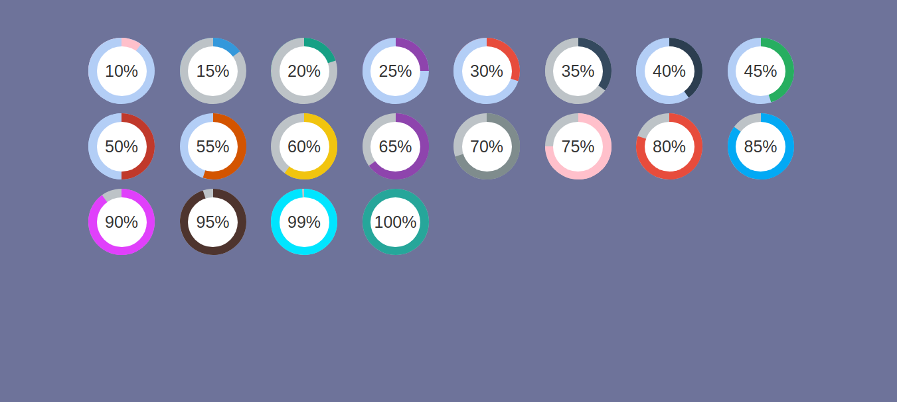

## jQuery-Circle-Plugin 

Circlos Is a jQuery library that enables you to make Circle progress easily and quickly with the possibility to add colors and control the duration and the size of the circle



## Installing / Getting started

To install this project you need to clone or download it.


```shell
git clone https://github.com/jamalhassouni/circlos.git
cd circlos
```

Documentation in progress ...
